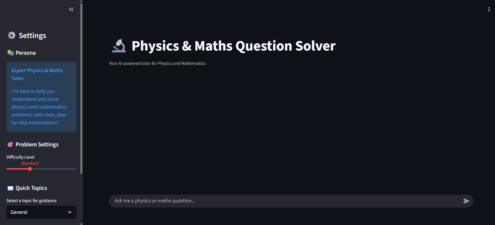
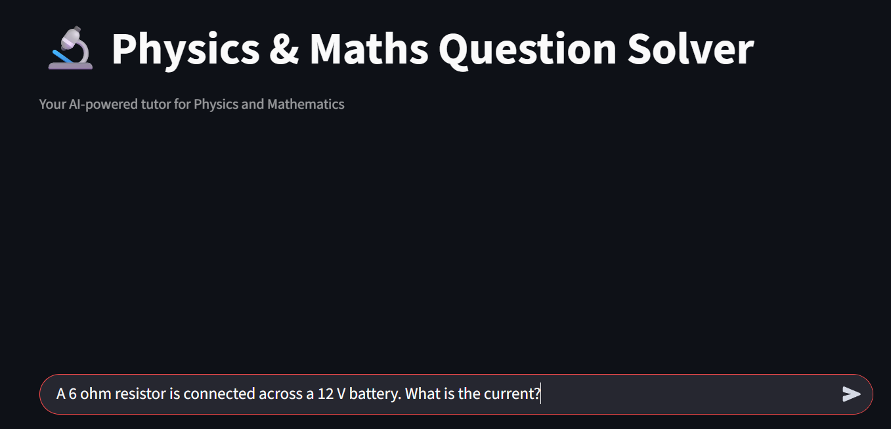
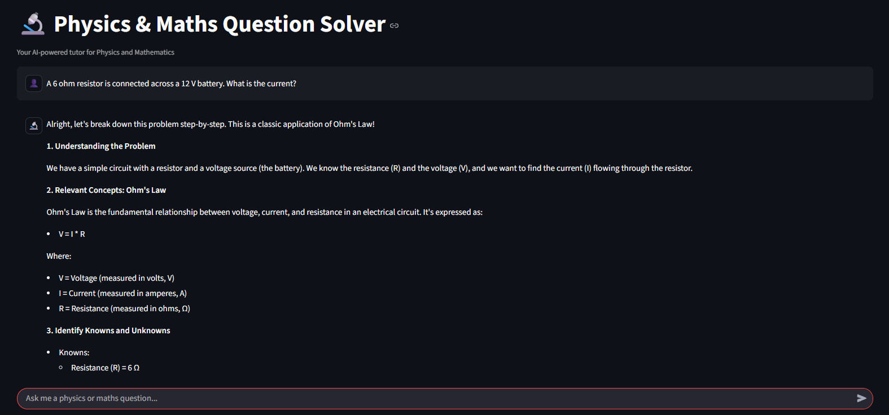

# 🔬 Physics & Maths Question Solver

An AI-powered chatbot built with Streamlit and Google's Gemini API that helps students solve physics and mathematics problems with clear, step-by-step explanations.

<<<<<<< HEAD
[](https://www.python.org/)
[](https://streamlit.io/)
[](https://www.gnu.org/licenses/gpl-3.0.html)

---

## ✨ Features

- 🤖 **AI-Powered Tutor**: Uses Google's Gemini 2.0 model for intelligent responses  
- 📚 **Expert Persona**: Acts as a patient and encouraging physics & maths tutor  
- 🎯 **Difficulty Levels**: Adjust explanations from *Beginner* to *Expert* level  
- 📖 **Topic Selection**: Quick access to specific subjects (Mechanics, Calculus, Algebra, etc.)  
- 💬 **Interactive Chat**: Clean, user-friendly chat interface  
- 🎨 **Modern UI**: Sidebar with organized settings for customization  

---

## 🚀 Demo

Try asking questions like:
- *"Solve the quadratic equation: 2x² + 5x - 3 = 0"*  
- *"Explain Newton's Second Law with an example"*  
- *"How do I calculate the derivative of x³ + 2x²?"*  
- *"What is the trajectory formula for projectile motion?"*  

For more examples, see [Chatbot_Example_Questions.txt](Chatbot_Example_Questions.txt).

**1. Home Page – Features Overview**  


**2. Example Question – Input Prompt**  


**3. AI Answer – Step-by-Step Solution**  


---

## 📋 Prerequisites

- Python **3.8** or higher  
- Google AI API Key (from [Google AI Studio](https://makersuite.google.com/app/apikey))  

---
=======


## ✨ Features

- 🤖 **AI-Powered Tutor**: Uses Google's Gemini 2.0 model for intelligent responses
- 📚 **Expert Persona**: Behaves as a patient and encouraging physics & maths tutor
- 🎯 **Difficulty Levels**: Adjust explanations from Beginner to Expert level
- 📖 **Topic Selection**: Quick access to specific subjects (Mechanics, Calculus, Algebra, etc.)
- 💬 **Interactive Chat**: Clean, user-friendly chat interface
- 🎨 **Modern UI**: Beautiful sidebar with organized settings

## 🚀 Demo

Ask questions like:
- "Solve the quadratic equation: 2x² + 5x - 3 = 0"
- "Explain Newton's Second Law with an example"
- "How do I calculate the derivative of x³ + 2x²?"
- "What is the trajectory formula for projectile motion?"

## 📋 Prerequisites

- Python 3.8 or higher
- Google AI API Key (from [Google AI Studio](https://makersuite.google.com/app/apikey))
>>>>>>> 532a4f0 (UPDATE)

## 🛠️ Installation

1. **Clone the repository**
```bash
<<<<<<< HEAD
git clone https://github.com/zhengbingquant/Physics-Maths-Solver-ChatBot.git
cd Physics-Maths-Solver-ChatBot
=======
git clone https://github.com/yourusername/physics-maths-solver.git
cd physics-maths-solver
>>>>>>> 532a4f0 (UPDATE)
```

2. **Install required packages**
```bash
pip install streamlit google-generativeai
```

3. **Add your API key**
<<<<<<< HEAD

Open the `Physics-Maths-Solver-Chatbot.py` file and replace the placeholder with your Google AI API key:
```python
GOOGLE_API_KEY = "your-api-key-here"
```

---
=======
   
   Open the `app.py` file and replace the placeholder with your Google AI API key:
   ```python
   GOOGLE_API_KEY = "your-api-key-here"
   ```
>>>>>>> 532a4f0 (UPDATE)

## 🎮 Usage

Run the Streamlit app:
```bash
<<<<<<< HEAD
streamlit run Physics-Maths-Solver-Chatbot.py
```

The app will open in your default browser at:  
👉 `http://localhost:8501`

---
=======
streamlit run app.py
```

The app will open in your default browser at `http://localhost:8501`
>>>>>>> 532a4f0 (UPDATE)

## 🎨 Features Breakdown

### Sidebar Settings
<<<<<<< HEAD
- **Persona Display**: Shows the AI tutor’s role and teaching style  
- **Difficulty Level**: Slider to adjust explanation complexity (Beginner → Expert)  
- **Quick Topics**: Dropdown menu for subject areas:
  - Physics: Mechanics, Thermodynamics, Electromagnetism, Quantum Physics  
  - Mathematics: Algebra, Calculus, Geometry, Statistics, Linear Algebra  
- **Clear Chat**: Button to reset conversation history  

### Chat Interface
- Clean message display with user and assistant avatars  
- Real-time response generation with a loading indicator  
- Markdown support for math expressions (LaTeX-style)  
- Persistent chat history during session  

---

## 🧠 How It Works

1. User enters a question in the chat interface  
2. Question is combined with the system prompt + difficulty settings  
3. Enhanced prompt is sent to Google’s Gemini API  
4. The API returns a step-by-step, educational response  
5. The chatbot maintains conversation context throughout the session  

---
=======

- **Persona Display**: Shows the AI tutor's role and teaching style
- **Difficulty Level**: Slider to adjust explanation complexity (Beginner → Expert)
- **Quick Topics**: Dropdown menu for subject areas:
  - Physics: Mechanics, Thermodynamics, Electromagnetism, Quantum Physics
  - Mathematics: Algebra, Calculus, Geometry, Statistics, Linear Algebra
- **Clear Chat**: Button to reset conversation history

### Chat Interface

- Clean message display with user and assistant avatars
- Real-time response generation with loading indicator
- Markdown support for formatted mathematical expressions
- Persistent chat history during session

## 🧠 How It Works

The chatbot uses a carefully crafted system prompt that defines its persona as an expert tutor. It:

1. Receives your question through the chat interface
2. Combines it with the system prompt and difficulty settings
3. Sends the enhanced prompt to Google's Gemini API
4. Returns a detailed, educational response
5. Maintains conversation context throughout the session
>>>>>>> 532a4f0 (UPDATE)

## 📦 Project Structure

```
physics-maths-solver/
│
<<<<<<< HEAD
├── Physics-Maths-Solver-Chatbot.py            # Main Streamlit application
├── Chatbot_Example_Questions.txt              # Example question prompts
└── README.md                                  # Project documentation
```

---

=======
├── app.py              # Main Streamlit application
├── README.md           # Project documentation
└── requirements.txt    # Python dependencies
```

>>>>>>> 532a4f0 (UPDATE)
## 🔧 Configuration

You can customize the chatbot by modifying:

<<<<<<< HEAD
- **System Prompt**: Edit the `SYSTEM_PROMPT` variable to change the tutor’s personality  
- **Model**: Change `"gemini-2.0-flash-exp"` to other Gemini models  
- **Topics**: Add or remove subjects in the topic selector  
- **Difficulty Levels**: Adjust the slider options  

---

## 🤝 Contributing

Contributions are welcome! To contribute:  
1. Fork the repository  
2. Create a feature branch (`git checkout -b feature/AmazingFeature`)  
3. Commit your changes (`git commit -m "Add some AmazingFeature"`)  
4. Push to the branch (`git push origin feature/AmazingFeature`)  
5. Open a Pull Request  

---

## 📝 License

Physics & Maths Question Solver – An AI-powered chatbot for solving physics and math problems  
Copyright (C) 2025  zhengbingquant  

This project is licensed under the GNU General Public License v3.0 – see the [LICENSE.txt](LICENSE.txt) file for details.


---

## 🙏 Acknowledgments

- Built with [Streamlit](https://streamlit.io/)  
- Powered by [Google Gemini API](https://ai.google.dev/)  
- Inspired by the need for accessible, AI-powered education tools  

---

## 📧 Contact

**Author:** zhengbingquant  
**GitHub:** [@zhengbingquant](https://github.com/zhengbingquant)  

Project Link: [https://github.com/zhengbingquant/Physics-Maths-Solver-ChatBot](https://github.com/zhengbingquant/Physics-Maths-Solver-ChatBot)

---

⭐ If you find this project helpful, please give it a star on GitHub!  

---


=======
- **System Prompt**: Edit the `SYSTEM_PROMPT` variable to change the tutor's personality
- **Model**: Change `gemini-2.0-flash-exp` to other Gemini models
- **Topics**: Add or remove subjects in the topic selector
- **Difficulty Levels**: Adjust the slider options

## 🤝 Contributing

Contributions are welcome! Feel free to:

1. Fork the repository
2. Create a feature branch (`git checkout -b feature/AmazingFeature`)
3. Commit your changes (`git commit -m 'Add some AmazingFeature'`)
4. Push to the branch (`git push origin feature/AmazingFeature`)
5. Open a Pull Request

## 📝 License

This project is licensed under the MIT License - see the [LICENSE](LICENSE) file for details.

## 🙏 Acknowledgments

- Built with [Streamlit](https://streamlit.io/)
- Powered by [Google Gemini API](https://ai.google.dev/)
- Inspired by the need for accessible, AI-powered education tools

## 📧 Contact

Your Name - [@yourtwitter](https://twitter.com/yourtwitter)

Project Link: [https://github.com/yourusername/physics-maths-solver](https://github.com/yourusername/physics-maths-solver)

---

⭐ If you find this project helpful, please give it a star on GitHub!
>>>>>>> 532a4f0 (UPDATE)
